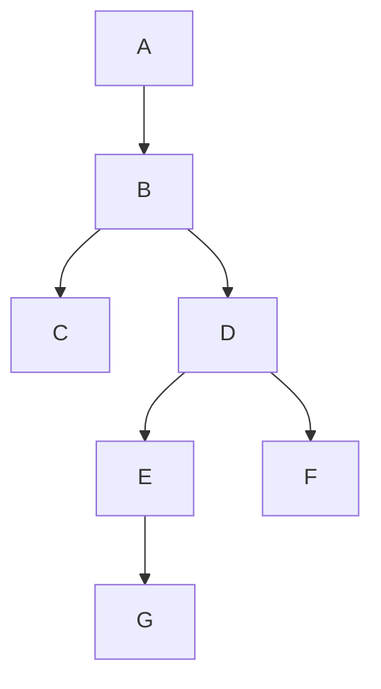

# Javascript 之树结构的示例分析

## 二叉树
二叉树是一种树形结构，它的特点是每个节点至多只有两棵树

>二叉树的子树有左右之分，其次序不能任意颠倒

---
## 遍历

二叉树有四种方法进行遍历： 
前三种方法：“根左右”，“左根右”，“左右根”
后一种方法：层序遍历

### 先序遍历 - 二叉树  - 根左右
口诀：
  1. 树根开始(A)，向左 -> （下一层）有左子树，没有右子树 <br/>
  2. 下一层，继续向左(B) to C 和 D, (下一层) C and D， 以此往复
  3. 已左子树为主，左子树有孩子， 走孩子， 左孩子然后走右子树”叔叔“，一切已左为主



### 中序遍历二叉树 左根右
口诀：
   1. 以左开始C,根(B), 右(DEFG) // C-B-DEFG
   2. 看DEFFG 子树， 左(EG), 根(D), 右(F) // C-B-(EG)-D-F-A
   3. 看EG 子树， E-G 
   4. 总结：CBEGDFA

  

### 后序遍历二叉树 左右根
口诀：
   1. 以左开始C, 右(DEFG), 根(B)// C-DEFG-B-A
   2. 看DEFFG 子树， 左(EG), 右(F), 根(D)// C-EG-F-D-B-A
   3. 看EG 子树， G-E
   4. 总结：CGEFDBA
   
  

## JS data structure 
> Object in object 
```
const root = {
    val:'A',
    left:{
        val:'B', 
        left:{
            val: 'D', 
            left: {
                val:'H',
                left: null, 
                right: {
                    val:'G',
                    left: null, 
                    right: null
                }
            }, 
            right:{
                val:'F', 
                left:null, 
                right: null
            }
        }, 
        right:{ 
            val: 'E', 
            left: null, 
            right: null
        }
    },
    right:{
        val:'C', 
        left:{
            val:'J',
            left:{
                val: 'K', 
                left: null, 
                right: null
            }, 
            right:null
        }, 
        right:{
           val:'I',
           left: null, 
           right: null 
        }
    }
}
```

### 建立二叉树

```
function TreeNode(){
    this.data = null 
    this.lchild = null
    this.rchild = null 
}
```

采用先序遍历二叉树的算法，构建一颗二叉树

```
TreeNode.createBiTree = function(nodeList){
    var i = 0; 
    return getNode(i, nodeList)
}

var getNode = (i, nodeList)=>{
    var node = null 
    val = nodeList[i++]
    if(!val){
        node = null 
    } else {
        node = new TreeNode();
        node.data = val; 
        node.lchild = getNode(i, nodeList)
        node.rchild = getNode(i, nodeList)
    }
    return node 
}
```

Prototype Method 

```
TreeNode.prototype = {
    constructor: TreeNode,
    _PreOrderTraverse: function(node){
        if(node){
            console.log(node.data);
            this._PreOrderTraverse(node.lchild);
            this._PreOrderTraverse(node.rchild);
        }
    },
    PreOrderTraverse: function(){
        console.log('PreOrder:');
        this._PreOrderTraverse(this);
    },
    _InOrderTraverse: function(node){
        if(node){
            this._InOrderTraverse(node.lchild);
            console.log(node.data);
            this._InOrderTraverse(node.rchild);
        }
    },
    InOrderTraverse: function(){
        console.log('InOrder:');
        this._InOrderTraverse(this);
    },
    _PostOrderTraverse: function(node){
        if(node){
            this._PostOrderTraverse(node.lchild);
            this._PostOrderTraverse(node.rchild);
            console.log(node.data);
        }
    },
    PostOrderTraverse: function(){
        console.log('PostOrder:');
        this._PostOrderTraverse(this);
    }
};
```

测试

```
    var treeNode = null

    var nodeList = ['A', 'B', 'C', null, null, 'D', 'E', null, 'G', null, null, 'F', null, null, null];
    
    //getting a binary tree from nodeList
    treeNode = TreeNode.createBiTree(nodeList); 
    
    //traversing the tree of treeNode
    treeNode.PreOrderTraverse();//ABCDEGF
    treeNode.InOrderTraverse();//CBEGDFA
    treeNode.PostOrderTraverse();//CGEFDBA
```
